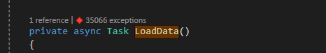
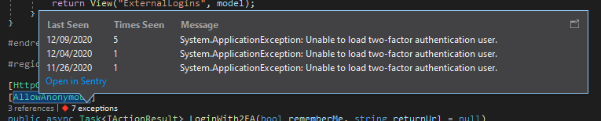
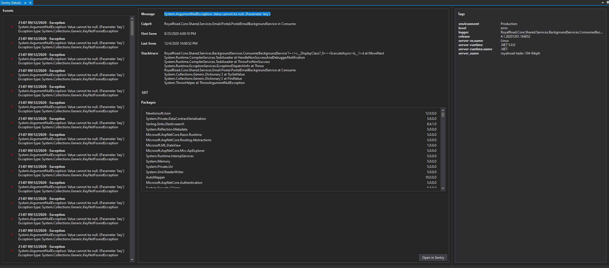

  
   

Sentry Integration with Visual Studio
===========

WIP Visual Studio CodeLens integration for Sentry, supporting both hosted and on-premises.

It currently only supports C#. PRs for other languages are welcome.

# Requirements
* .NET Framework 4.8
* Visual Studio 2017 or 2019

# TODO:
- [ ] Figure out why the custom CodeLens UI via `IViewFactory` doesn't work
- [ ] Either cache namespaces or only read the source files up to the namespace definition to reduce unnecessary IO

